# How to Deploy a Simple React Web App on OpenShift 
Goal: Create a “Hello, world!” React app → Dockerize it → Push to a registry → Import & run it on OpenShift’s Developer Console.

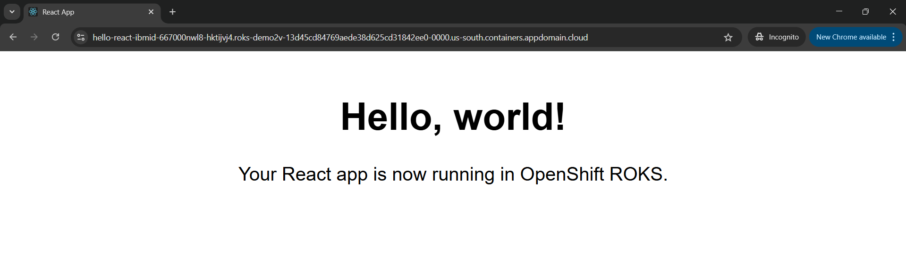

This guide provides a comprehensive walkthrough for deploying a React web application to Red Hat OpenShift on IBM Cloud , covering environment setup on WSL/Ubuntu, `kubectl` installation, application scaffolding, Dockerization, image management, and deployment using both the OpenShift Web Console and `kubectl` CLI.

**Target OpenShift Environment (from initial context):**

* **Platform:** Red Hat OpenShift Container Platform
* **Console:** `https://console-openshift-console.roks-demo`
* **Project Example:** `ibmid-667000nwl8-xxxx` (Ensure you are targeting your correct project in OpenShift)

## 📋 Table of Contents

1.  Environment Setup (WSL/Ubuntu)
2.  Installing `kubectl` on Ubuntu/WSL
3.  Scaffolding a Simple React App
4.  Dockerizing the React App
5.  Building & Pushing the Image
6.  Deploying on OpenShift (Web Console)
7.  Alternative: Deploy via `kubectl` CLI
8.  Verification & Next Steps
9.  Improvements & Enhancements


## 1. Environment Setup (WSL/Ubuntu)

Before we begin, ensure you have a clean Ubuntu 22.04+ environment. This could be on Windows Subsystem for Linux (WSL), a Virtual Machine (VM), or a bare-metal installation. The key requirements are:

* `sudo` privileges to install software.
* Essential command-line tools: `bash`, `curl`, `gnupg`.
* **Docker Engine:** We'll be containerizing our React app. Docker CE (Community Edition) should be installed from the [official Docker repository](https://docs.docker.com/engine/install/ubuntu/).
* **Node.js & npm:** For creating and building the React application. A Node.js version of v16 or higher is recommended. We'll use NodeSource distributions for installation. `npm` (Node Package Manager) is typically included with Node.js. (Yarn is an alternative package manager, but this guide will focus on npm).

To help automate the setup of `curl`, `gnupg`, Docker, and Node.js/npm, you can use the script below.

**Automated Setup Script (`setup_dev_env.sh`):**

You can save the following bash script to a file (e.g., `setup_dev_env.sh`), make it executable (`chmod +x setup_dev_env.sh`), and then run it with `sudo ./setup_dev_env.sh`.

```bash
#!/usr/bin/env bash

# Script to setup development environment on Ubuntu 22.04+
# Installs: curl, gnupg, Docker CE, Node.js (v20.x LTS) & npm

# Exit on any error
set -e

# Function to check if a command exists
command_exists() {
    command -v "$1" >/dev/null 2>&1
}

# Function to check if a dpkg package is installed (more reliable for apt packages)
package_installed() {
    dpkg-query -W -f='${Status}' "$1" 2>/dev/null | grep -q "ok installed"
}

echo "🚀 Starting Environment Setup for Ubuntu 22.04+ 🚀"
echo "----------------------------------------"

# --- Update package lists ---
echo "➡️ Updating package lists..."
sudo apt-get update -y
echo "✅ Package lists updated."
echo "----------------------------------------"

# --- Install basic utilities (curl, gnupg) ---
echo "➡️ Checking/Installing basic utilities (curl, gnupg)..."

if ! package_installed curl; then
    echo "Installing curl..."
    sudo apt-get install -y curl
    echo "✅ curl installed."
else
    echo "✅ curl is already installed."
fi

if ! package_installed gnupg; then
    echo "Installing gnupg..."
    sudo apt-get install -y gnupg
    echo "✅ gnupg installed."
else
    echo "✅ gnupg is already installed."
fi
echo "----------------------------------------"

# --- Install Docker CE ---
echo "➡️ Checking/Installing Docker CE..."
if command_exists docker; then
    echo "✅ Docker appears to be installed."
    docker --version
else
    echo "Installing Docker CE..."
    # Install prerequisites for adding Docker repo
    sudo apt-get install -y ca-certificates # curl is already handled

    # Add Docker's official GPG key:
    echo "Adding Docker GPG key..."
    sudo install -m 0755 -d /etc/apt/keyrings
    # Remove old key if it exists to avoid conflicts with the new .asc format
    if [ -f /etc/apt/keyrings/docker.gpg ]; then
        echo "Removing old docker.gpg key..."
        sudo rm /etc/apt/keyrings/docker.gpg
    fi
    sudo curl -fsSL https://download.docker.com/linux/ubuntu/gpg -o /etc/apt/keyrings/docker.asc
    sudo chmod a+r /etc/apt/keyrings/docker.asc

    # Add the Docker repository to Apt sources:
    echo "Adding Docker repository..."
    echo \
      "deb [arch=$(dpkg --print-architecture) signed-by=/etc/apt/keyrings/docker.asc] https://download.docker.com/linux/ubuntu \
      $(. /etc/os-release && echo "$VERSION_CODENAME") stable" | \
      sudo tee /etc/apt/sources.list.d/docker.list > /dev/null

    echo "Updating package lists after adding Docker repo..."
    sudo apt-get update -y

    echo "Installing Docker CE packages..."
    sudo apt-get install -y docker-ce docker-ce-cli containerd.io docker-buildx-plugin docker-compose-plugin
    echo "✅ Docker CE installed."
    docker --version

    echo "ℹ️ To run Docker commands without sudo, you can add your user to the 'docker' group:"
    echo "   sudo usermod -aG docker \$USER" # Escaped $USER for correct display in script
    echo "   Then, you MUST log out and log back in for the group changes to take effect."
fi
echo "----------------------------------------"

# --- Install Node.js (e.g., v20.x LTS) and npm using NodeSource ---
NODE_MAJOR_VERSION="20" # Current LTS version as of early 2024, satisfies "v16+"
echo "➡️ Checking/Installing Node.js v\${NODE_MAJOR_VERSION}.x and npm..." # Escaped ${NODE_MAJOR_VERSION}

# Check if node is installed and if it's the target major version
NODE_INSTALLED_CORRECT_VERSION=false
if command_exists node; then
    CURRENT_NODE_VERSION=\$(node -v) # Escaped $()
    if [[ "\$CURRENT_NODE_VERSION" == "v\${NODE_MAJOR_VERSION}"* ]]; then # Escaped variables
        NODE_INSTALLED_CORRECT_VERSION=true
        echo "✅ Node.js v\${NODE_MAJOR_VERSION}.x is already installed." # Escaped
        node -v
        npm -v
    else
        echo "ℹ️ An existing Node.js version is installed (\$CURRENT_NODE_VERSION), but it's not v\${NODE_MAJOR_VERSION}.x." # Escaped
        echo "    If you need Node.js v\${NODE_MAJOR_VERSION}.x specifically, consider using a version manager like 'nvm'" # Escaped
        echo "    or uninstalling the current version before running this script again."
        echo "    Skipping Node.js v\${NODE_MAJOR_VERSION}.x installation to avoid conflict." # Escaped
    fi
else
    echo "Node.js not found."
fi


if ! \$NODE_INSTALLED_CORRECT_VERSION && ! (command_exists node && [[ "\$(node -v)" != "v\${NODE_MAJOR_VERSION}"* ]]); then # Escaped
    echo "Installing Node.js v\${NODE_MAJOR_VERSION}.x and npm via NodeSource..." # Escaped
    # Ensure curl is available (should be from earlier step)
    if ! command_exists curl; then
        echo "Error: curl is required for NodeSource setup but not found." >&2
        exit 1
    fi

    echo "Downloading and running NodeSource setup script for Node.js v\${NODE_MAJOR_VERSION}.x..." # Escaped
    # The NodeSource script adds the GPG key and repository.
    # Running with sudo -E to preserve environment variables like HOME, which some scripts might need.
    curl -fsSL https://deb.nodesource.com/setup_\${NODE_MAJOR_VERSION}.x | sudo -E bash - # Escaped

    echo "Updating package lists after adding NodeSource repo..."
    sudo apt-get update -y # Though NodeSource script might do this

    echo "Installing nodejs package..."
    sudo apt-get install -y nodejs # This will install Node.js and npm

    echo "✅ Node.js v\${NODE_MAJOR_VERSION}.x and npm installed." # Escaped
    node -v
    npm -v
fi
echo "----------------------------------------"

echo "🎉 Environment setup script finished successfully! 🎉"
echo "REMINDERS:"
echo "  - For Docker: If you added your user to the 'docker' group, log out and log back in."
echo "  - For Node.js: If you had a different version, this script attempted to avoid conflicts. Manage Node.js versions using 'nvm' (Node Version Manager) for more flexibility if needed."
echo "----------------------------------------"

```
**To use the script:**
1.  Copy the entire block of code above, starting with `#!/usr/bin/env bash` and ending with the last `echo "----------------------------------------"`.
2.  Paste it into a new file in your Ubuntu environment. Name the file `setup_dev_env.sh`.
3.  Open a terminal, navigate to the directory where you saved the file, and make it executable:
    ```bash
    chmod +x setup_dev_env.sh
    ```
4.  Run the script with sudo privileges:
    ```bash
    sudo ./setup_dev_env.sh
    ```
This script will guide you through the installation of the necessary prerequisites.

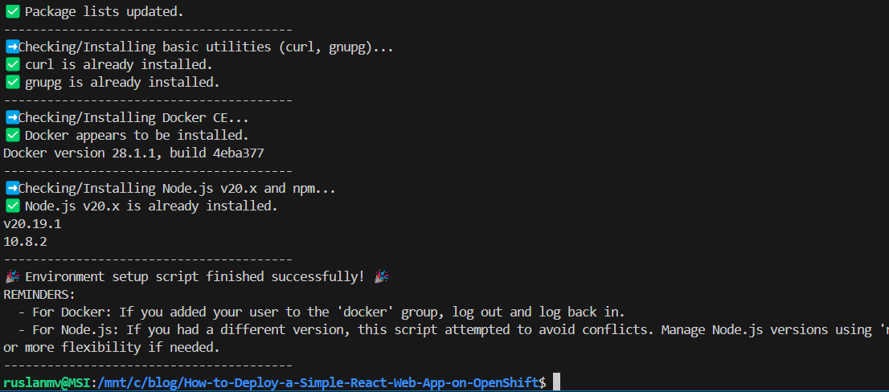

Once these tools are in place, you’ll also need `kubectl` to talk to your ROKS cluster. The next section covers its installation.

## 2. Installing `kubectl` on Ubuntu/WSL

Save this as `install_kubectl_ubuntu.sh`, then run it to:

* Remove old `kubernetes-xenial` repos
* Point at `pkgs.k8s.io`
* Install & verify `kubectl`

```bash
#!/usr/bin/env bash
set -euo pipefail
IFS=$'\n\t'

# --- CONFIGURATION ---
STABLE="v1.30"  # target Kubernetes minor version branch
# As of May 2025 (current date), please verify the latest stable minor version for pkgs.k8s.io
# by visiting https://kubernetes.io/releases/ or checking the available directories at
# https://pkgs.k8s.io/core:/stable:/
# For example, if v1.33 is the latest desired stable, update STABLE="v1.33".
# v1.30 should still be available but might not be the most recent.

echo
echo "👉 Installing kubectl (target: $STABLE)..."
echo

# 1) Prereqs
echo "Updating package lists and installing prerequisites..."
sudo apt-get update -y
sudo apt-get install -y curl ca-certificates gnupg apt-transport-https

# 2) Clean old k8s repos
echo "Cleaning up old Kubernetes repository configurations..."
sudo rm -f /etc/apt/sources.list.d/kubernetes*.list
# The following sed command attempts to remove lines referencing old Kubernetes package sources
# from any .list files in /etc/apt/sources.list.d/ and the main /etc/apt/sources.list file.
# The || true ensures that the script doesn't exit if these patterns are not found.
sudo sed -i.bak -E '/(packages\.cloud\.google\.com\/apt|apt\.kubernetes\.io|kubernetes-xenial)/d' \
  /etc/apt/sources.list.d/*.list /etc/apt/sources.list 2>/dev/null || true


# 3) Add new key for pkgs.k8s.io
echo "Adding Kubernetes GPG key..."
sudo mkdir -p /etc/apt/keyrings
# Remove the key file if it exists to ensure non-interactive overwrite
sudo rm -f /etc/apt/keyrings/kubernetes-apt-keyring.gpg
# Download the public signing key for the new community-owned repositories
curl -fsSL "https://pkgs.k8s.io/core:/stable:/$STABLE/deb/Release.key" \
  | sudo gpg --dearmor -o /etc/apt/keyrings/kubernetes-apt-keyring.gpg
sudo chmod a+r /etc/apt/keyrings/kubernetes-apt-keyring.gpg # Ensure the key is readable

# 4) Add new repo for pkgs.k8s.io
echo "Adding Kubernetes APT repository..."
# Define the repository source
echo "deb [signed-by=/etc/apt/keyrings/kubernetes-apt-keyring.gpg] https://pkgs.k8s.io/core:/stable:/$STABLE/deb/ /" \
  | sudo tee /etc/apt/sources.list.d/kubernetes.list

# 5) Install kubectl
echo "Updating package lists and installing kubectl..."
sudo apt-get update -y
sudo apt-get install -y kubectl

# 6) Verify
echo
echo "Verifying kubectl client version:"
# The --short flag was removed in kubectl v1.24. Use 'kubectl version --client' instead.
kubectl version --client
echo
echo "✅ kubectl installed!"
echo "ℹ️ Note: The STABLE version used was $STABLE. Please ensure this is the desired version for your needs."
````

Make the script executable and run it:

```bash
chmod +x install_kubectl_ubuntu.sh
./install_kubectl_ubuntu.sh
```

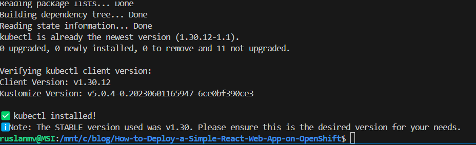


## We are going to push our image in a IBM cloud 
install_ibmcloud_cli.sh

```bash
#!/usr/bin/env bash

# Script to install the IBM Cloud CLI on Linux

# Exit immediately if a command exits with a non-zero status.
set -e

# Function to check if a command exists
command_exists() {
    command -v "$1" >/dev/null 2>&1
}

# Function to check if a dpkg package is installed (for curl check on Debian/Ubuntu)
package_installed() {
    dpkg-query -W -f='${Status}' "$1" 2>/dev/null | grep -q "ok installed"
}

echo "🚀 Attempting to install IBM Cloud CLI..."
echo "----------------------------------------"

if command_exists ibmcloud; then
    echo "✅ IBM Cloud CLI is already installed."
    ibmcloud --version
    echo "----------------------------------------"
    echo "If you wish to update it, you can often use: ibmcloud update"
    exit 0
fi

echo "IBM Cloud CLI not found. Proceeding with installation."
echo ""

# Ensure curl is installed, as it's needed to download the installer
if ! command_exists curl; then
    echo "curl command not found. Attempting to install curl..."
    if command_exists apt-get; then
        echo "Updating package lists (apt-get)..."
        sudo apt-get update -y
        echo "Installing curl..."
        sudo apt-get install -y curl
        if ! command_exists curl; then
            echo "❌ Failed to install curl. Please install curl manually and try again."
            exit 1
        fi
        echo "✅ curl installed successfully."
    else
        echo "❌ apt-get not found. Cannot automatically install curl."
        echo "Please install curl manually and try again."
        exit 1
    fi
else
    echo "✅ curl is already available."
fi
echo "----------------------------------------"

# Install IBM Cloud CLI
# The official installer script from IBM handles the installation details.
# It typically installs to /usr/local/bin/ibmcloud and may prompt for sudo if not run as root.
# Piping to 'sudo sh' ensures the script has necessary permissions for system-wide install.
echo "➡️ Downloading and running the IBM Cloud CLI installer..."
echo "This may take a few moments and might require sudo password if not already root."

if curl -fsSL https://clis.cloud.ibm.com/install/linux | sudo sh; then
    echo "✅ IBM Cloud CLI installation script executed."
else
    echo "❌ IBM Cloud CLI installation script failed to execute properly."
    exit 1
fi
echo "----------------------------------------"

# Verify installation
echo "➡️ Verifying IBM Cloud CLI installation..."
if command_exists ibmcloud; then
    echo "✅ IBM Cloud CLI installed successfully!"
    ibmcloud --version
    echo "----------------------------------------"
    echo "Next steps:"
    echo "1. Log in to IBM Cloud: ibmcloud login -a https://cloud.ibm.com"
    echo "   (or ibmcloud login --sso if you use a federated ID)"
    echo "2. Install any necessary plugins, e.g., for Container Registry:"
    echo "   ibmcloud plugin install container-registry -r 'IBM Cloud'"
else
    echo "❌ IBM Cloud CLI installation failed or it's not in PATH."
    echo "   Please check the output above for errors or try manual installation from:"
    echo "   https://cloud.ibm.com/docs/cli?topic=cli-install_cli"
    exit 1
fi

echo "🎉 IBM Cloud CLI setup script finished."
```

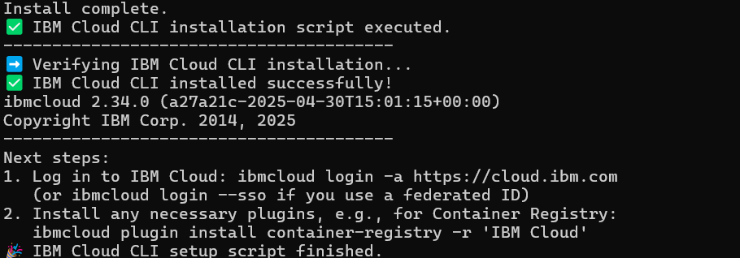

## 3\. Scaffolding a Simple React App

Let's create a basic React application.

```bash
npx create-react-app hello-react
cd hello-react
```

Now, edit `src/App.js` to display a simple message:

```javascript
// src/App.js
import React from 'react';

function App() {
  return (
    <div style={{
      fontSize: '2rem',
      textAlign: 'center',
      padding: '2rem',
      fontFamily: 'sans-serif'
    }}>
      <h1>Hello, world!</h1>
      <p>Your React app is now running in OpenShift ROKS.</p>
    </div>
  );
}

export default App;
```

You can test it locally:

```bash
npm start
```
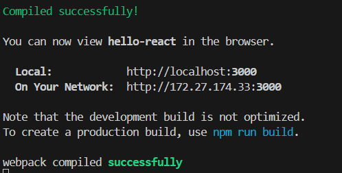
Open `http://localhost:3000` in your browser.

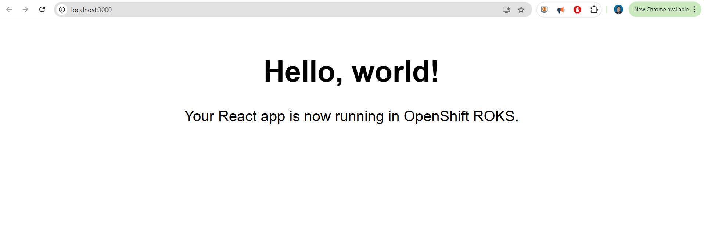


---

## 4. Dockerizing the React App

In your `hello-react/` directory, create a `Dockerfile` (no extension) with the following content. We’ve switched to the official **unprivileged** NGINX image so it:

* Runs as a non-root user (OpenShift arbitrary UID–safe)
* Listens on port `8080` (avoiding privileged ports <1024)
* Doesn’t try to patch a read-only `/etc/nginx` at startup

```dockerfile
# hello-react/Dockerfile

# --------------------------
# 1. Build stage (Node.js)
# --------------------------
FROM node:23-alpine AS builder
WORKDIR /app

# Install dependencies exactly as in lockfile
COPY package*.json ./
RUN npm ci

# Copy source & build static assets
COPY . .
RUN npm run build

# --------------------------
# 2. Production stage (NGINX)
# --------------------------
FROM nginxinc/nginx-unprivileged:stable-alpine

# Copy built React app into NGINX’s html folder
COPY --from=builder /app/build /usr/share/nginx/html

# OpenShift will mount this image read-only, but nginx-unprivileged
# already runs as a non-root user (UID 101) and listens on 8080.
EXPOSE 8080

# Run NGINX in the foreground
CMD ["nginx", "-g", "daemon off;"]
```

### Explanation 

* **`nginxinc/nginx-unprivileged:stable-alpine`**

  * Runs as a non-root user by default (OpenShift arbitrary UIDs won’t need `anyuid` SCC).
  * Listens on port **8080**, so you avoid the bind-to-80 “Permission denied” error.
  * No more IPv6 patch script failures on a read-only filesystem.

* **Port mapping**

  * Internally listens on **8080**, but externally you can map it to 80/443 via your Service/Route.

---

## 5. Local Run Sanity Check

Before pushing to OpenShift, verify it works locally:

```bash
# Build and tag
docker build -t ruslanmv/hello-react:1.0.0 .

# Run and map port 8080 → 8080
docker run --rm -p 8080:8080 ruslanmv/hello-react:1.0.0
```

Visit [http://localhost:8080](http://localhost:8080) and you should see your “Hello, world!” page—no permission or filesystem errors in the logs.

---


## 5\. Building & Pushing the Image to IBM Cloud Container Registry

With your `hello-react` application Dockerized, the next step is to build the image and push it to a container registry. This makes the image accessible for deployment to your OpenShift cluster. We will focus on using the **IBM Cloud Container Registry (ICR)**.

Let's get started by installing the necessary CLIs (if you haven't already), setting up your first private registry namespace in ICR, and then pushing your `hello-react` image.

**A. Prerequisites: Setting up IBM Cloud CLI and Container Registry**

1.  **Install the IBM Cloud CLI:**
    If you don't have it installed, follow the [official instructions](https://www.google.com/search?q=https://cloud.ibm.com/docs/cli%3Ftopic%3Dcli-install_cli). For Linux, a common method is:

    ```bash
    curl -fsSL https://clis.cloud.ibm.com/install/linux | sh
    ```

    Verify the installation:

    ```bash
    ibmcloud --version
    ```

2.  **Install the Docker CLI:**
    The Docker CLI should already be installed if you used the environment setup script from **Section 1**. If not, please ensure Docker is installed and running.

3.  **Install the Container Registry Plug-in:**
    This plug-in extends the IBM Cloud CLI with commands for ICR.

    ```bash
    ibmcloud plugin install container-registry -r 'IBM Cloud'
    ```

    If it's already installed, you can update it using `ibmcloud plugin update container-registry`.

4.  **Log in to your IBM Cloud Account:**

    ```bash
    ibmcloud login -a https://cloud.ibm.com
    ```

    If you have a federated ID, use `ibmcloud login --sso`. Follow the prompts to complete the login.

5.  **Set Your Target IBM Cloud Container Registry Region:**
    Ensure you're targeting the correct region where you want to host your images. For example, to target US South:

    ```bash
    ibmcloud cr region-set us-south
    ```

    To see available regions, use `ibmcloud cr regions`.

6.  **Create a Namespace in IBM Cloud Container Registry:**
    A namespace provides a unique space for your images within a region. Choose a unique name for your namespace. This namespace will be part of your image URL.

    ```bash
    ibmcloud cr namespace-add <my_namespace>
    ```

    Replace `<my_namespace>` with your chosen namespace. For example, if your project or organization uses a specific naming convention like `cc-667000nwl8-n8918mfv-cr`, you would use:

    ```bash
    ibmcloud cr namespace-add cc-667000nwl8-n8918mfv-cr
    ```

    Verify the namespace is added: `ibmcloud cr namespace-list`.

**B. Building Your `hello-react` Docker Image**

Now, navigate to your `hello-react` project directory (the one containing your `Dockerfile`). Build the Docker image, tagging it directly with the IBM Cloud Container Registry path. This path will be `REGISTRY_HOSTNAME/<my_namespace>/<repository_name>:<tag>`.

For ICR in US South, the `REGISTRY_HOSTNAME` is `us.icr.io`.

1.  **Build and Tag the Image for ICR:**
    Replace `<my_namespace>` with the namespace you created in the previous step. We'll use `hello-react` as the repository name and `1.0.0` as the tag.
    ```bash
    docker build -t us.icr.io/<my_namespace>/hello-react:1.0.0 .
    ```
    For example, using the specific namespace format from your context:
    ```bash
    docker build -t us.icr.io/cc-667000nwl8-n8918mfv-cr/hello-react:1.0.0 .
    ```

**C. Pushing the Image to Your Private ICR Namespace**

1.  **Log Your Local Docker Daemon into IBM Cloud Container Registry:**
    This command uses your IBM Cloud CLI session to authenticate Docker.

    ```bash
    ibmcloud cr login
    ```

    If successful, you'll see a "Logged in\!" message.

2.  **Push the Image to ICR:**
    Use the same image name you used in the `docker build` command.

    ```bash
    docker push us.icr.io/<my_namespace>/hello-react:1.0.0
    ```

    For the specific example:

    ```bash
    docker push us.icr.io/cc-667000nwl8-n8918mfv-cr/hello-react:1.0.0
    ```

3.  **Verify Your Image is in Your Private Registry:**
    You can list images in your namespace using the IBM Cloud CLI:

    ```bash
    ibmcloud cr image-list --restrict <my_namespace>
    ```

    Or, to see all images you have access to (if you omit `--restrict`):

    ```bash
    ibmcloud cr image-list
    ```

    You should see `us.icr.io/<my_namespace>/hello-react` with the tag `1.0.0` listed.

Your `hello-react` image, for instance `us.icr.io/cc-667000nwl8-n8918mfv-cr/hello-react:1.0.0`, is now stored in your private IBM Cloud Container Registry and is ready to be deployed to OpenShift\!


*(Optional: Alternative - Docker Hub)*

*If you prefer to use Docker Hub:*

1.  *Build: `docker build -t YOUR_DOCKERHUB_USERNAME/hello-react:1.0.0 .`*
2.  *Login: `docker login` (enter your Docker Hub credentials)*
3.  *Push: `docker push YOUR_DOCKERHUB_USERNAME/hello-react:1.0.0`*


Or you can use the our script [build_and_push_icr.sh](build_and_push_icr.sh) you copy where the Dockerfile it is.


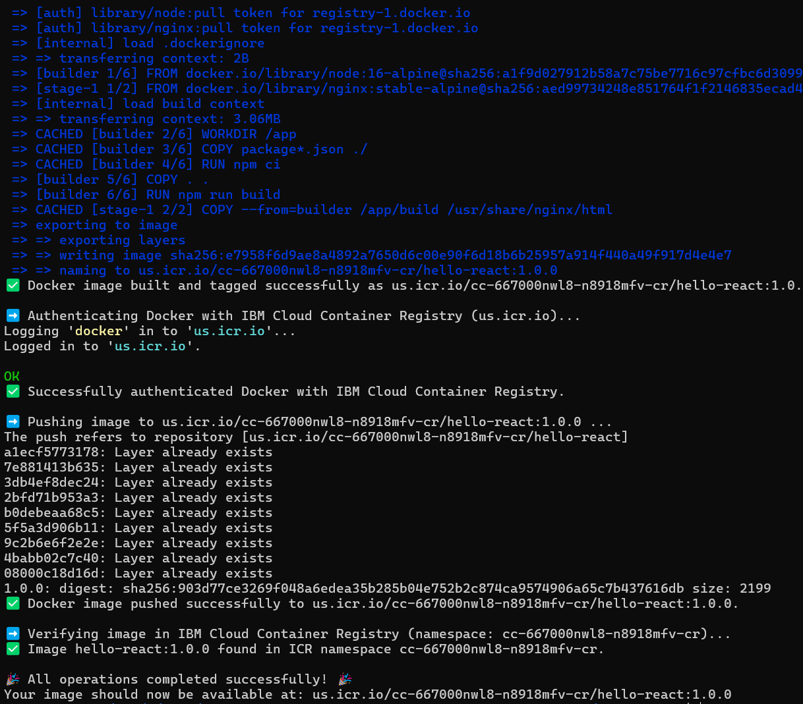


## 6. Deploying on OpenShift (Web Console)

Once your `hello-react` application is containerized and the image is available in a container registry, you can deploy it to your OpenShift on ROKS cluster using the web console. This section will guide you through deploying your image using two common scenarios: from a private registry like IBM Cloud Container Registry (ICR) and from a public registry like Docker Hub.

**A Note on Resource Quotas:**
Your OpenShift project likely has ResourceQuotas in place. This means that when you deploy an application, you **must** specify **Resource Requests** (the amount of CPU/memory guaranteed to your container) and **Resource Limits** (the maximum amount of CPU/memory your container can use). If these are not defined, your deployment will be rejected with a "failed quota" error, similar to the one you encountered. We will cover setting these in the steps below.

**Initial Steps in the OpenShift Web Console:**

1.  **Log in to your ROKS console** and ensure you are in the **Developer** perspective.
2.  Navigate to your target **Project** from the project dropdown list.
3.  In the left navigation pane, click the **`+Add`** button.

From here, the steps will diverge slightly based on whether your image is in a private or public registry.

---

### Method A: Deploying from a Private Registry (e.g., IBM Cloud Container Registry - ICR)

Private container registries require authentication. If you haven't already configured an Image Pull Secret for your ICR namespace in this OpenShift project, please refer to the troubleshooting steps at the end of this "Method A" section.

**Image to Deploy (Example for ICR):**
`us.icr.io/cc-667000nwl8-n8918mfv-cr/hello-react:1.0.0`

**🚀 Deploying Your Application from ICR**

1.  **Navigate to Add Application**:
    * After the initial steps (logged in, correct project, click `+Add`), choose **"Container Image"**.
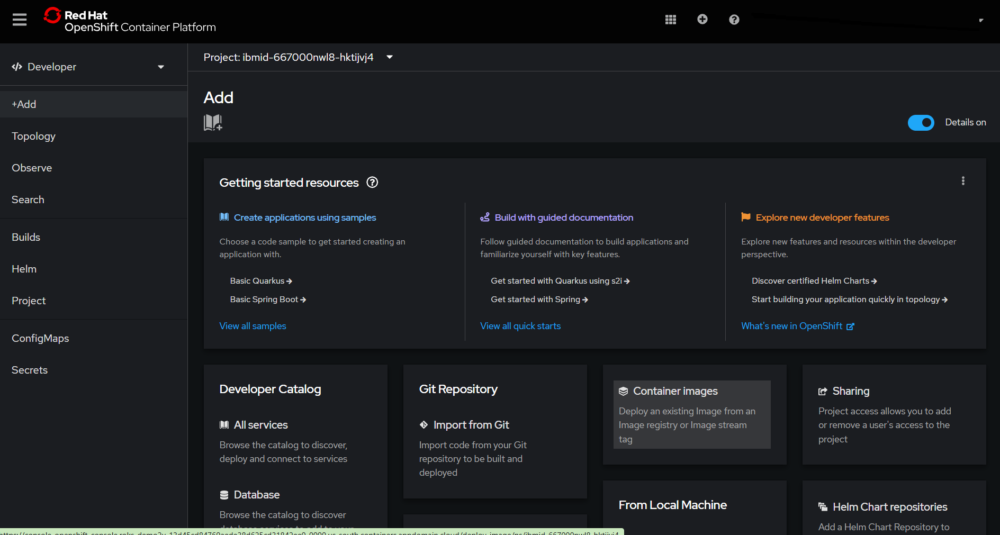


    
2.  **Fill in the Image Details**:
    * **Image name from external registry**: Enter the full path to your image in ICR:
        `us.icr.io/cc-667000nwl8-n8918mfv-cr/hello-react:1.0.0`
3.  **Configure Application, Deployment, and Resource Limits**:
    * **Application Name**: e.g., `hello-react-icr-app`.
    * **Name** (for Deployment resource): e.g., `hello-react-icr`.
    * **Runtime icon**: Choose an appropriate icon.
    * **Labels**: Add any desired labels.
    * **Setting Resource Requests and Limits (Crucial for Quotas):**
        * Look for a section typically labeled **"Resource Limits"**, **"Compute Resources"**, or sometimes under "Advanced options" or "Scaling".
        * You will need to set values for:
            * **CPU Request**: The minimum amount of CPU guaranteed to the container.
            * **CPU Limit**: The maximum amount of CPU the container can use.
            * **Memory Request**: The minimum amount of memory guaranteed to the container.
            * **Memory Limit**: The maximum amount of memory the container can use.
        * **Example Values (Adjust as Needed):**
            * *CPU Request:* `1` (unit is typically cores, e.g., `1` for 1 core, `0.5` or `500m` for half a core)
            * *CPU Limit:* `4` (cores)
            * *Memory Request:* `64Mi` (Mebibytes)
            * *Memory Limit:* `128Mi` (Mebibytes)
            **❗ Important Advisory on Example Values:** The values above (`CPU Request: 1 core`, `CPU Limit: 4 cores`, `Memory Request: 64Mi`, `Memory Limit: 128Mi`) are provided as per your request for an example. While `64Mi/128Mi` for memory is a reasonable starting point for a very simple web application, a CPU request of `1 core` and a limit of `4 cores` is quite generous for a basic "Hello World" React app served by Nginx and might be more than needed or available under your project's quota for such a simple app.
            **Recommended Action:** Always start with values that you believe are reasonable for your application's typical load and then **monitor its actual resource consumption** in OpenShift. Adjust these requests and limits based on observed performance and the specific quotas enforced in your project. Setting requests appropriately helps Kubernetes schedule your pods efficiently, while limits prevent a single container from starving other applications on the same node.
4.  **Configure Routing / Networking**:
    * Ensure **`Create a route to the Application`** is checked.
    * **Target port**: For the Nginx-served React app, this is `80`.
5.  **Create the Application**:
    * Review your settings and click **"Create"**.

**🔐 Troubleshooting ICR: Authorization & Image Pull Secrets (If not done already)**

If, after clicking "Create", your Pods are stuck with `ImagePullBackOff` or `ErrImagePull`, or you get an authorization error *before* the quota error, it means OpenShift cannot authenticate with your private ICR. You need an Image Pull Secret.

* **Step 1: Create an IBM Cloud IAM API Key** (if you don't have one for this purpose).
* **Step 2: Create the Image Pull Secret in OpenShift (via Web Console UI as you detailed previously):**
    1.  Navigate to **Workloads > Secrets**.
    2.  Click **Create > Image Pull Secret**.
    3.  **Secret Name**: e.g., `ibm-cr-pull-secret`.
    4.  **Authentication Type**: `Image Registry Credentials`.
    5.  **Registry Server Address**: `us.icr.io` (or your ICR region's hostname).
    6.  **Username**: `iamapikey`.
    7.  **Password**: Your IBM Cloud IAM API key.
    8.  **Email**: e.g., `user@example.com`.
    9.  Click **Create**.
* **Step 3: Link Secret to Default Service Account (via Web Console UI as you detailed):**
    1.  Navigate to **User Management > ServiceAccounts**.
    2.  Select the `default` service account.
    3.  Go to the **YAML** tab.
    4.  Add/update the `imagePullSecrets` section:
        ```yaml
        imagePullSecrets:
          - name: ibm-cr-pull-secret # Use your secret name
        ```
    5.  Click **Save**.

After setting up the pull secret and resource limits, your deployment from ICR should proceed.

---

### Method B: Deploying from a Public Registry (e.g., Docker Hub)

Deploying a **public** image from Docker Hub is generally simpler as it usually doesn't require pull secrets. However, you **still need to set resource requests and limits** if your project has quotas.

**Image to Deploy (Example for Docker Hub):**
`docker.io/ruslanmv/hello-react:1.0.0` (or `ruslanmv/hello-react:1.0.0`)

**🚀 Deploying Your Application from Docker Hub**

1.  **Navigate to Add Application**:
    * After the initial steps (logged in, correct project, click `+Add`), choose **"Container Image"**.
2.  **Fill in the Image Details**:
    * **Image name from external registry**: Enter the path to your public Docker Hub image:
        `docker.io/ruslanmv/hello-react:1.0.0`
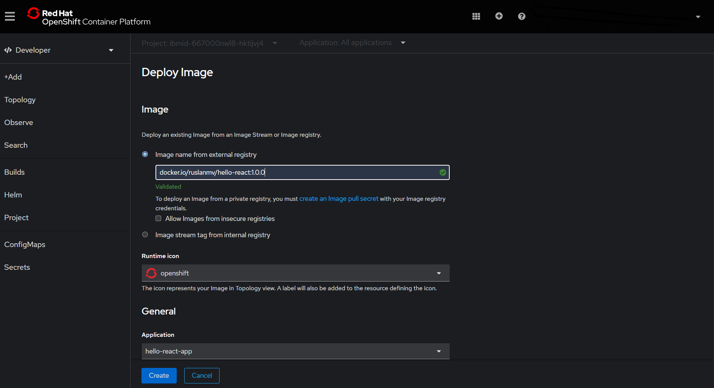

3.  **Configure Application, Deployment, and Resource Limits**:
    * **Application Name**: e.g., `hello-react-dockerhub-app`.
    * **Name** (for Deployment resource): e.g., `hello-react-dockerhub`.
    * **Runtime icon**: Choose an appropriate icon.
    * **Setting Resource Requests and Limits (Crucial for Quotas):**
        * As in Method A, find the **"Resource Limits"** or **"Compute Resources"** section.
        * Set appropriate values for CPU Request, CPU Limit, Memory Request, and Memory Limit.
        * **Example values (Adjust as Needed):**
            * *CPU Request:* `1` (core)
            * *CPU Limit:* `2` (cores)
            * *Memory Request:* `128Mi`
            * *Memory Limit:* `256Mi`
        * **❗ Reminder:** The CPU values (`1 core` request, `2 cores` limit) are generous for a simple demo. Adjust all these values based on your application's actual needs and your project's available quotas.
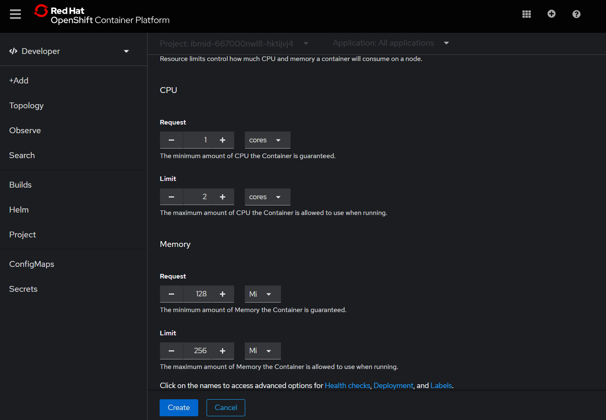

4.  **Configure Routing / Networking**:
    * Ensure **`Create a route to the Application`** is checked.
    * **Target port**: `80`.
5.  **Create the Application**:
    * Click **"Create"**.


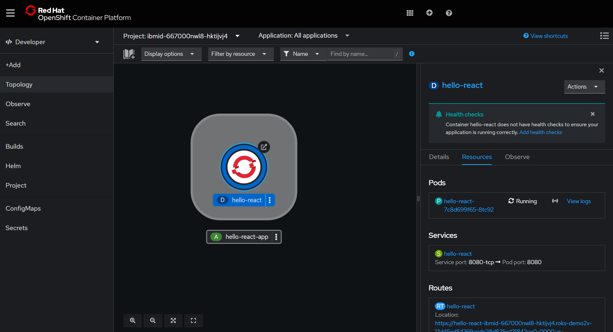


**🔐 (Optional) For Private Images on Docker Hub:**

If your image on Docker Hub were **private**, you would:
1.  Create an Image Pull Secret (similar to ICR: Workloads > Secrets > Create > Image Pull Secret) with:
    * **Secret Name**: e.g., `dockerhub-pull-secret`.
    * **Registry Server Address**: `https://index.docker.io/v1/` (or `docker.io`).
    * **Username**: Your Docker Hub username.
    * **Password**: Your Docker Hub password or a Personal Access Token (PAT).
    * **Email**: Your Docker Hub email.
2.  Link this `dockerhub-pull-secret` to the `default` service account (User Management > ServiceAccounts > default > YAML).

---

### Common Next Steps (After Successful Deployment)

Regardless of the method used, once you click "Create" and have correctly configured image pull secrets (if needed) and resource limits:

1.  **Monitor Deployment Progress**:
    * Go to the **Topology** view. Your new application should appear.
    * Click on it to see Pods transitioning from `Pending`/`ContainerCreating` to `Running`. If they get stuck, check Pod events (`oc describe pod <pod-name> -n <project>` or via the UI) for errors related to quotas or image pulls.

2.  **Access Your Application**:
    * Once the Pod is `Running`, find the Route URL (from Topology view's "Open URL" icon, or under "Networking" > "Routes").
    * Click the URL to see your `hello-react` app.

This revised section now uses your specified example values for CPU and Memory requests/limits, along with the necessary context and advice for adjusting them.
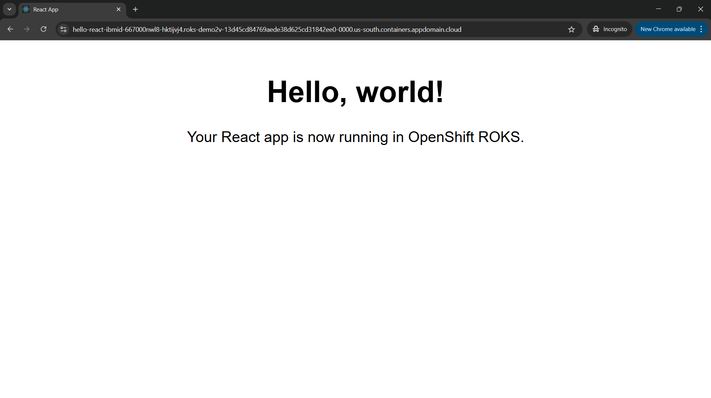
### Alternative via Web Console: Using a BuildConfig (from Dockerfile in Git)

If your code (including the `Dockerfile`) is in a Git repository and you want OpenShift to build  "Create BuildConfig":

1.  Click **`+Add`**.
2.  Choose **`From Git`**.
3.  Enter your Git Repository URL.
4.  OpenShift usually detects the Dockerfile. If not, you might need to specify the "Dockerfile" strategy under advanced options.
5.  Configure the application name, resource name, and ensure "Create a route" is selected.
6.  OpenShift will create a `BuildConfig`, an `ImageStream`, build the image, and then deploy it. You can find the "Create BuildConfig" form  if you navigate through "Builds" -\> "BuildConfigs" -\> "Create BuildConfig" or if this option appears in the `+Add` flow for more advanced Git import scenarios.
      * **Screenshot Context :** The fields visible in your screenshot ("Name", "Source type", "Images - Build from", "Push to") are part of the `BuildConfig` creation. If you select "Git Repository" as `Source type`, you provide the Git URL. "Push to" would typically be an "Image Stream Tag" within OpenShift.


## 7\. Alternative: Deploy via `kubectl` CLI

First, ensure `kubectl` is configured to communicate with your ROKS cluster. You typically download the `kubeconfig` file from the IBM Cloud console for your cluster and set the `KUBECONFIG` environment variable or merge it into your default `~/.kube/config`.

```bash
export KUBECONFIG=/path/to/your/downloaded.kubeconfig
kubectl get nodes # Test connectivity
```

Create the following YAML files in your `hello-react` project directory. Remember to replace `ruslanmv/hello-react:1.0.0` with your actual image path.

**`deployment.yaml`**

```yaml
apiVersion: apps/v1
kind: Deployment
metadata:
  name: hello-react
  labels:
    app: hello-react
spec:
  replicas: 1
  selector:
    matchLabels:
      app: hello-react
  template:
    metadata:
      labels:
        app: hello-react
    spec:
      containers:
        - name: hello-react
          image: ruslanmv/hello-react:1.0.0 # <-- UPDATE THIS LINE
          ports:
            - containerPort: 80
          # Liveness and Readiness Probes (Recommended - See Improvements section)
          # livenessProbe:
          #   httpGet:
          #     path: /
          #     port: 80
          #   initialDelaySeconds: 5
          #   periodSeconds: 10
          # readinessProbe:
          #   httpGet:
          #     path: /
          #     port: 80
          #   initialDelaySeconds: 5
          #   periodSeconds: 10
```

**`service.yaml`**

```yaml
apiVersion: v1
kind: Service
metadata:
  name: hello-react
  labels:
    app: hello-react
spec:
  type: ClusterIP # Default, exposes the service on an internal IP in the cluster
  selector:
    app: hello-react # Must match the labels of the Pods
  ports:
    - protocol: TCP
      port: 80       # Port the service will be available on within the cluster
      targetPort: 80 # Port the container is listening on
```

**`route.yaml` (OpenShift Specific)**
For standard Kubernetes Ingress, you would use an `Ingress` resource. OpenShift uses `Route`.

```yaml
apiVersion: route.openshift.io/v1
kind: Route
metadata:
  name: hello-react
  labels:
    app: hello-react
spec:
  to:
    kind: Service
    name: hello-react # Name of the service to route to
  port:
    targetPort: 80 # Target port on the service (must match a port in the service definition)
  # tls: # Optional: for HTTPS
  #   termination: edge
  #   # If using a custom domain, you might specify 'host' here.
  #   # Otherwise, OpenShift will generate one.
```

Now, apply these configurations to your cluster:

```bash
kubectl apply -f deployment.yaml
kubectl apply -f service.yaml
kubectl apply -f route.yaml
```

Wait for the deployment to be ready:

```bash
kubectl rollout status deployment/hello-react
```

Get the public URL assigned by the Route:

```bash
# This command extracts the host from the route. It might take a moment for the host to be assigned.
kubectl get route hello-react -o jsonpath='{.spec.host}'
```

You should see an output like `hello-react-yourproject.yourclusterdomain.com`. Point your browser at `http://<that-host>`.

## 8\. Verification & Next Steps

  * **Topology View:** In the OpenShift Web Console, the **Topology** view should now show your `hello-react` application components (Deployment, Pod, Service, Route).
  * **Access App:** Clicking the hostname provided by the Route (either from `kubectl get route` or in the console's "Routes" section or Topology view) should open your “Hello, world\!” page.

**Scale up replicas:**

```bash
kubectl scale deployment hello-react --replicas=3
```

Verify in the console or with `kubectl get pods -l app=hello-react`.

**Roll out a new version:**

1.  Make changes to your React app.
2.  Rebuild your Docker image with a new tag (e.g., `1.0.1`):
    ```bash
    docker build -t ruslanmv/hello-react:1.0.1 .
    docker push ruslanmv/hello-react:1.0.1
    ```
3.  Update the deployment to use the new image:
    ```bash
    kubectl set image deployment/hello-react hello-react=ruslanmv/hello-react:1.0.1
    # Or edit deployment.yaml and kubectl apply -f deployment.yaml
    ```
4.  Monitor the rollout:
    ```bash
    kubectl rollout status deployment/hello-react
    kubectl rollout history deployment/hello-react
    ```

## 9\. Improvements & Enhancements

  * **Externalize Configuration:** Use `ConfigMap`s for environment-specific settings (like API URLs). Mount them as environment variables or files into your Pods. For React apps built with Vite or similar, environment variables prefixed with `VITE_` (for Vite) or `REACT_APP_` (for Create React App) can be set at build time or injected into the `index.html` at runtime via an entrypoint script in Nginx. For runtime configuration, you'd typically have a small script that generates a `config.js` file from environment variables when the Nginx container starts, and your `index.html` would load this script.
  * **Secure Secrets:** Store sensitive data like API keys in OpenShift `Secret`s and mount them securely into your Pods (as environment variables or files). Never hardcode secrets in your image.
  * **Health-Checking (Probes):**
      * **Liveness Probes:** `kubectl` uses these to know when to restart a container (e.g., if the app crashes).
      * **Readiness Probes:** `kubectl` uses these to know when a container is ready to start accepting traffic. A Pod is considered ready when all of its containers are ready.
      * Add `livenessProbe` and `readinessProbe` sections to your `Deployment` container spec (see commented-out example in `deployment.yaml`). For a simple Nginx serving static files, an HTTP GET probe to the root path (`/`) on port 80 is usually sufficient.
  * **Auto-scaling:** Define a `HorizontalPodAutoscaler` (HPA) to automatically scale the number of Pods based on CPU utilization or custom metrics.
    ```yaml
    # hpa.yaml
    # apiVersion: autoscaling/v2
    # kind: HorizontalPodAutoscaler
    # metadata:
    #   name: hello-react
    # spec:
    #   scaleTargetRef:
    #     apiVersion: apps/v1
    #     kind: Deployment
    #     name: hello-react
    #   minReplicas: 1
    #   maxReplicas: 5
    #   metrics:
    #   - type: Resource
    #     resource:
    #       name: cpu
    #       target:
    #         type: Utilization
    #         averageUtilization: 80 # Target 80% CPU utilization
    ```
    Apply with `kubectl apply -f hpa.yaml`.
  * **CI/CD Pipeline:** Integrate with OpenShift Pipelines (Tekton) or external CI/CD tools like GitHub Actions, Jenkins, or GitLab CI to automate the build, test, and deployment process whenever you push changes to your Git repository.
  * **Monitoring & Logging:**
      * OpenShift comes with a built-in monitoring stack (Prometheus, Grafana). Explore the "Observe" section in the OpenShift console.
      * Ensure your application logs to `stdout`/`stderr` so OpenShift can collect them. Access logs via `kubectl logs <pod-name>` or the console.
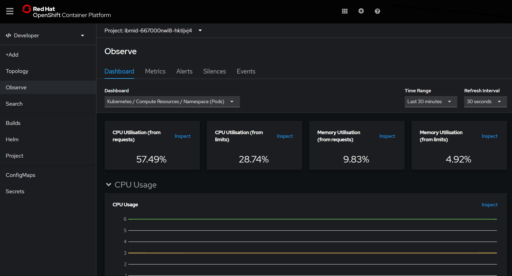


 Congratulations\! You’ve now gone from a blank Ubuntu box to a live React app on ROKS, with options to deploy via both the web console and `kubectl`.

